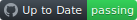

<h1 align="center" >Nicholas Anthony Lacapria </h1> 
<h3>Junior Fullstack Developer for Hire!</h3>

 

<h3><a href="https://docs.google.com/document/d/1r2-chwDNHayg-r1JFp0AznEsQWdPh9bjPm8xcH_AVDE/edit?usp=sharing">Nicholas Anthony Lacapria's Resume</a></h3>

<h3>Giving Feedback </h3>

- 1. What's an example of an issue I have had in working with another team member? How have I addressed it?

I have not experienced much confrontation because I have always been open to new ideas or thoughts on projects different than mine, but one time I did received feedback from a team member who wanted different styling done within the project than I had already. They said they had originally used a WYSIWYG editor to create the HTML and CSS for the project to create a typical look and styling through the app, so my styling I had already done did not match what they had already intended for the project. I did not want their stylings to go to waste so I quickly copied the CSS over into the project and remade all the elements to fit what they had intended in the first place. After seeing what they wanted I saw my development module fit much better with all the other components and pages already within the project. This was important since what I originally had made me standout from everyone because the styling did not look neutral with everyone elses modules.     

- 2. What are some benefits and challenges to working with the different personalities and work styles on my team? 

I think it is great to see views or opinions different than mine when it comes to working on a project. I am new to the professional MERN stack dev. field so I think learning from others who have had more experience than me is important. I am interested in collaborating with everyone else who have different personalities or cultural views than I have. I believe I could benefit by seeing the differences of coding styles I have to them so I could acquire a productive, programmatic way to produce and test the most efficient software while developing. When I look at technology and why it is technology has evolved into what it is now from the beginning, I think the most important aspect to molding greater software products is the ability to learn from other examples or styles of code that make development most important.        

<h3>Receiving Feedback </h3>

- 1. How do your teammates tend to describe you?
What's the most difficult piece of feedback you've ever received?

Teammates tend to describe me as diligent, productive, and receptive to change. I think the need for change in technology should always be ongoing so the most difficult pieces of feedback to receive is feedback on code where no changes are expected. I have always been accustomed to search for changes even after MVP has been made.

- 2. How have you incorporated that feedback into your personal development?

I think natural code refactoring, functional recursion, explicit/implicit object referencing, or data encapsulation are all great examples to receiving feedback on changing a module that has already met standard MVP expectations. Fundamentally these concepts are all great ways to polish any finished piece into a professional build that should withstand any future updates, tests or new build/deployment.   

<h2>About</h2>

I am skilled in flow-chart creation to design popular user interfaces and user experience designs to streamline cross compatibility and accessibility. I am very interested in creating websites, applications, and games to display similar user experiences despite differences of client screen size. I have contributed to projects and worked in teams with other programmers to design projects that complete goals outlined within the rubric or user's story. I am currently interested in PERN/MERN stack development jobs where nodejs, express, and react are being used for websites, games, or software development. 

<h2>Education</h2>
<b>Lambda School of Code, Online</b><i> — Full Stack Web Development & Computer Science</i>
 
MAR 2020 - JULY 2021
 
Completed projects, assignments, & new material walk through examples all pertaining to Framework Testing, CSS, Javascript, React, Node.js, & Computer Science in Python. At the end of the last course’s section was lab assignments where I got to experience what it is like to work with a team to design a project from scratch or by other programmer’s code. Readme documentation was written and trello boards were used to stay  organized as to who would complete what user stories for pull requests on the finished project. This is where I have gained my skill sets to have the confidence to participate in testing and developing real front/back-end design projects. Lambda has taught me very valuable skill sets that will make me an in demand developer. Not only have I gained valuable guided walk through code but I have also been able to participate in my own assignments where I was able to exercise what I learned. The school is very determined to supply all the tools needed for me to land a career making over $50,000 a year. They prove this by offering career coaches who guide all students on what is needed to gain a career in the tech field as a full stack developer by using the newest most stable technology available today.    
 
 
<b>Udemy, Online </b> <i> - E-commerce/Web Development, Penetration Testing, 3D-Graphical Designs & Game Development</i>
 
JAN 2015 - PRESENT
 
This is where I have gained experience with PHP  and learned what regex is to create e-commerce development level projects which use an admin exclusive content management system for all products and features easily moderated by the admin. I took courses here on network penetration testing & ethical hacking which not only opened my understanding on how to benchmark the security of an OS or network on a virtual machine, but it also helped me make the switch from windows to linux to use as a main operating system with Debian. This is also where I gained experience with CryEngine, Unity, and Unreal Engine to learn how to create 3D games with C++ or C#. 3D games were what first sparked my interest to become a developer . The very first gaming library I gained experience on was XNA using C# because I wanted to make an Xbox game. That then led to learning how to create 3D models and animations with Blender. After learning enough about Blender I realized I needed to first know more about Python to create good animation and 3D modeling scripts. The long haul at Udemy kept bringing me back to a real understanding of if I wanted to start off a career as a programer it might be best to learn React and Redux state management, get much better at Javascript, and learn how to manage a persistent database across a network with Node.js; this is why I chose to attend Lambda.     

<h2>Experience</h2>

- :skull_and_crossbones: I'm currently working on react2024 video at my newest organization <a href="https://github.com/Knewmule/react2024">knewmule </a>
- :paperclip: I'm looking to collaborate on any projects that will pay :money_with_wings: or help the community. 
- :sweat_drops: I'm looking for help with <a href="https://regexr.com/">Regex Pattern manipulation</a>
- :v: Ask me about  <a href="https://trello.com/invite/rouletteprogramming/a02a0c8c9ac1ef64f0965fa269c3e9df" title="See my trello boards for a invite to work on live projects">any trello board development projects to build web apps, tools, or games for pay or experience</a>
- :envelope: How to reach me 
 
&nbsp; &nbsp;
- :point_right:  Pronouns <b>Fullstack Developer/Programmer, he/him</b>
-  :mountain: Fun fact ... I have worked with most organizations under the name extrude575757. This account name change is a continuation for the first account on github still frozen. 

<h4>Newest Organization & projects as Bigproblems55 </h4>
- <b>Knewmule Organization</b> (https://github.com/Knewmule) :mouse:

- <b>React 2024 Udemy Video</b>(https://github.com/Knewmule/react2024) :chipmunk:

- <b>Python Django Project</b>(https://github.com/Knewmule/django2.2-python-3.6) :shamrock:

- <b>Spinner Game in React</b>(https://github.com/Knewmule/spinnerGame) :clock1:

- <b>Roulette Game in Javascript & React</b>(https://github.com/Knewmule/roulette) :clock2:

- <b>React & Javascript assignments while at Lambda as extrude575757</b>(https://github.com/Reactbottle) :snowflake:

- <b>React & Nodejs assignments while at Lambda as extrude575757</b>(https://github.com/Stemcatch) :open_umbrella:

<h5>Past organizations i've been at as extrude575757:</h5>
- <b>Lambda-School-Labs</b>(https://github.com/Lambda-School-Labs) :zap:

- <b> Story Squad FrontEnd Dev</b>(https://github.com/Lambda-School-Labs/story-squad-fe) :comet:

- <b>Pintereach1</b>(https://github.com/Pintereach1) :anchor:

- <b>PTBW-Water-My-Plants</b>(https://github.com/PTBW-Water-My-Plants) :airplane:

- <b>Build-Week-secretfamilyrecipes-2020</b>(https://github.com/Build-Week-secretfamilyrecipes-2020) :hourglass:

- <b>Build-week-secret-family-recipes-9</b>(https://github.com/Build-week-secret-family-recipes-9) :moon:
<h6>HTML, Javascript, PHP & JSX:</h6>  

           
<b>Normalized HTML5 and CSS3 styling markup with Javascript through nodejs libraries to create web apps that streamline a niched user experience.</b>

           

* HTML5 experience with Drupal8, Twig, and PHP: 
  * Used Twig templates to style drupal 8 elements within a PHP syntax web page.
  * I took full advantage of Drupal8's content management system, cron-jobs, and modules. 
           

         

           
<b>Committed JSX and ES6 syntax with React to public github repos that contain single paged web apps designed for user interaction.</b>  

           

* Experience with JSX syntax to render Components to React Dom:
  * Took advantage of component life cycles to make conditional JSX renders.
  * Used Industry Standard common component refactoring so the components could be used within any file of the project.

* Experience with Javascript DOM objects:
  * Used Chrome tools to read and manipulate DOM objects.
  * Took advantage of Javascript events and used proper event propagation and bubbling for a functional user experience. 
           

         

<h6>CSS3,LESS & SASS:</h6> 

           
<b>Styled CSS/Less/SASS elements to display component layouts and position elements to automatically configure themselves based on the user's screen space</b> 

           

* CSS3 styling:
  * Used flex & flex-inline display as an auto responsive cross-compatible layout design.
  * Used block and inline display to position elements based on their absolute or float value. 
  * Normalized CSS with the Myers Reset & 62.5% html font size.
  * Used at media signs to control the element responsiveness depending on screen size for cross-compatibility. 
* CSS styling with Less:
  * Used less-watch-compiler to watch a less index file for changes so it would initiate into a transpile file of CSS syntax within the CSS styling folder.
  * Used Less syntax indention to weight classes, ID's, and tags together for responsive Desktop First layout design. 
  * Took advantage of mixins so variable values could be a parameter of color, class, or id styles.  
           

         

<h6>Projects:</h6> 

           
<b><a href="https://skins-charts-darkmode.onrender.com/">Darkmode Persistant Storage</a></b>

           

- [x] Made <b>Nov. 4, 2020</b> 

- [x] In this project I compose stateful logic to persist in local storage the skin color of the user's choice. The object is to use this in a hook so the app is more efficient. Since it uploads charts of various crypto currency the more scrolling you do the more performance you lose, but once the hook is installed you should see a performance increase while scrolling down. 

- [x] Made with  
           

 

           
<b><a href="https://distracted-joliot-156406.netlify.app/">Pentireach App </a> or <a href="https://loving-einstein-b5195c.netlify.app/"> Pentireach Marketing Page</a></b> 

           

- [x] Made from <b>Aug. 14, 2020 - Aug. 27, 2020 </b>   

- [x] The pentereach app is designed to allow a user to place articles within containers for research. This project was made from scratch right after learning Javascript, which was the 2nd section before learning React as a front-end design library. The main goal of the project was to demonstrate responsiveness, styling with flex, and a few functionality features with Javascript.  

- [x] Made with  
           

 

           
<b><a title="Production version of sites" href="https://responsive-design-1-hyg7.onrender.com/">Portfolio Site </a><a title="Portfolio" href="https://responsive-design-1-hyg7.onrender.com/">Portfolio Site </a></b>   

           

- [x] Made from <b>July 16, 2020 - Presently Maintained </b>   

- [x] The main portfolio page where I will be showcasing all projects. Right now projects I did in 2020 are being upgraded to react v6 through npx react-create-app. The app does run on a backend but all project information is mapped threw a stored json object. In future releases all pictures and json objects should be stored in a live database.  

- [x] Made with 

 

           
<b><a href="https://nasa-photo-of-the-day.onrender.com">NASA photo of the day</a></b>   

           

           
- [x] Made from <b>September 22, 2020 - September. 26, 2020 </b>  

- [x] Here I learned how to read the dom with a NASA photo of the day api. The api allows you a NASA photo, video, and column write up each day. With enough development it will be fully functional and search any day a user puts into the search box.

- [x] Made with 

### Tools & Languages I work with!

<h6>Skills</h6>

* <b>Successful with:</b>
  * UML flow-chart creation and WYSIWYG editors.
  * Popular UX/UI Designing, Accessability, & Cross Compatibility.
  * Testing, Logging, Commenting, & Stack Debugging.
  * Front-end coding, with Flexbox/LESS/CSS3 styling & Reactjs.
  * Back-end coding with sqlite or postgre sql.
  * Back-end env sessions with Knex state management.
  * Git, gist, & mercurial reversions.
  * Python standard library & algorithims.
  * Gimp, Inkscape, Blender, & photo-shop imaging, texturing 
  * Design pattern principles
### :envelope: Get In Touch

 
&nbsp; &nbsp;

 

<h2>Repositories</h2>

  
  
  

  

  
  
  
  

  

  
  
  
  

  

  
  
  
  

  

  
  
  
  

  

  
  
  
  

 
 

